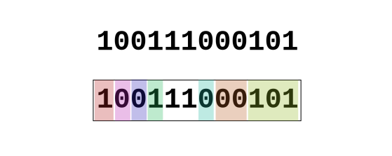

# Diretórios e metadados de arquivos

## Créditos
Principal referência: "Unix System Programming in OCaml",
Xavier Leroy e Didier Rémy, 2014

Licenciado sob a Creative Commons

Todos os manuais (`man 2 stat`, `man 3 opendir`, etc.) originários do macOS Catalina.
* Há diferenças em relação ao Linux, e mesmo entre versões do Linux
* Confira especifidades do seu sistema

## Estratégia de aprendizagem

Tentar associar:
*   Comando da _linha de comando_ 
```
rm delete.me
```      
* Chamada de sistema
```C 
main () {
  char* n = "delete.me";
  unlink(n);
}
```

## Objetivo

Escrever um programa em C que use as chamadas de sistema 
para realizar o mesmo que o seguinte comando faz:

```
$ ls -l
```
Análise:
* `ls` remete a acessar o arquivo-diretório
* `-l` remete a obter todos os metadados de cada entrada do diretório
  * tipo do arquivo (normal, diretório ou _link_ simbólico)
  * permissões de acesso
  * proprietários (usuário e grupos)
  * tempos de acesso
  * tamanho

Método:
* Fazendo requisições ao _kernel_ (chamadas de sistema se possível)


## Opendir (e readdir, closedir, rewinddir)
```
$ man 3 opendir
```
Resultado:
```
DIRECTORY(3)             BSD Library Functions Manual             DIRECTORY(3)

NAME
     opendir, fdopendir, readdir, readdir_r, telldir, seekdir, rewinddir,
     closedir, dirfd -- directory operations

LIBRARY
     Standard C Library (libc, -lc)

SYNOPSIS
     #include <dirent.h>

     DIR *
     opendir(const char *filename);
```

---
* Função em C (manual 3)
* Estrutura de dados `DIR`
* Funções associadas
   * `readdir`
   * `rewinddir`
   * `closedir`

Obs.: Embora não seja chamada de sistema, em Kotlin Native, também está disponível na biblioteca `platform.posix`

---
```
           dirp = opendir(".");
           if (dirp == NULL)
                   return (ERROR);
           int counter = 0;
           while (readdir(dirp) != NULL) {
                   counter++;
           }
           (void)closedir(dirp);
           return counter;
```   
* É um programa exemplo 
   * Funcionalidade: contar as entradas no diretório atual
* `readdir` é um iterador
   * A cada execução ele retorna uma entrada diferente
   * Retorna `NULL` quando termina
   
`readdir` (iterador) mantém internamente o estado do percurso

### Exercício

* Fazer um programa que imprime os nomes dos arquivos.
    * Para isso, use o retorno de `readdir` que desprezamos anteriormente
    * A função `readdir` retorna um ponteiro para uma `struct dirent` (entrada de diretório) 
    * Um dos campos da _struct_ é o nome da entrada
    * Tudo isso está em `man 3 readdir`
    
## Descritores de arquivos

* Duas formas de acessar arquivos
   * Nome
   * Descritor de arquivo
   
* Informações em tempo de execução vinculadas a um descritor de arquivo
   * Posição atual de escrita/leitura
   * Direitos de acesso
   * Acesso bloqueante ou não bloqueante
   * Sobrescrita ou _append_
   
* Descritores de arquivo padrão
   * `stdin` : número 0, _default_ é o teclado   
   * `stdout`: número 1, _default_ é a tela
   * `stderr`: número 2, _default_ é a tela

## Redirecionamentos

* Entrada (`stdin`)
```shell script
% cmd < f
```
* Saída (`stdout`)
```shell script
% cmd > f
```
* Erro (`stderr`)
```shell script
% cmd 2> f
```

---
* `redireciona.c`
```c 
#include <stdio.h>
int main() {
  fprintf(stdout, "Saída!\n");
  fprintf(stderr, "ERRO!\n");
}
```
* Experimentos:
```shell
$ ./redireciona 
$ ./redireciona > saida.txt
$ ./redireciona 2> erro.txt
$ ./redireciona > saída.txt 2> erro.txt
```

## Metadados

* Chamadas de sistema
  * `stat` : coleta diversas informações
  * `lstat` : variação de `stat` que difere no tratamento de _link_ simbólico (não o segue; retorna seus metadados)
  * `fstat` : variação de `stat` que recebe descritor de arquivos
  * Estrutura de dados `stat`

Tudo no mesmo `man 2 stat`

## Estrutura de dados `stat`

``` 
$ man 2 stat
```

``` 
     struct stat { /* when _DARWIN_FEATURE_64_BIT_INODE is defined */
         dev_t           st_dev;           /* ID of device containing file */
         mode_t          st_mode;          /* Mode of file (see below) */
         nlink_t         st_nlink;         /* Number of hard links */
         ino_t           st_ino;           /* File serial number */
         uid_t           st_uid;           /* User ID of the file */
         gid_t           st_gid;           /* Group ID of the file */
         dev_t           st_rdev;          /* Device ID */
         struct timespec st_atimespec;     /* time of last access */
         struct timespec st_mtimespec;     /* time of last data modification */
         struct timespec st_ctimespec;     /* time of last status change */
         struct timespec st_birthtimespec; /* time of file creation(birth) */
         off_t           st_size;          /* file size, in bytes */
         blkcnt_t        st_blocks;        /* blocks allocated for file */
         blksize_t       st_blksize;       /* optimal blocksize for I/O */
         uint32_t        st_flags;         /* user defined flags for file */
         uint32_t        st_gen;           /* file generation number */
         int32_t         st_lspare;        /* RESERVED: DO NOT USE! */
         int64_t         st_qspare[2];     /* RESERVED: DO NOT USE! */
     };
```
Diversos metadados estão nos _inodes_.

### Sobre tipos específicos dos _header files_ das chamadas de sistema

* Exemplos
    * `dev_t`
    * `mode_t`
    * `inode_t`
* Em geral, podem ser sinônimos (`typedef`s) de tipos numéricos sem sinal
    * Compatíveis com `long long unsigned`
    * `%llu` no `printf`

### Sobre mascaramento de _bits_ 

Quando a informação requer poucos _bits_, é comum agregar várias informações em uma palavra.

Cada _campo de bits_ da palavra representa uma informação. A palavra funciona como um "registro feito de _bits_".



Para ler um campo, é preciso "mascarar" os demais, realizando um "e bit a bit" (_bitwise and_) entre a palavra e
a máscara. A máscara é composta de 0s nas respectivas posições dos campos ignorados, e 1s no campo de interesse.

Exemplo:

* Código de 4 bits para registro de ventos.
    * Bit 3
        * 1 : Dia
        * 0 : Noite
    * Bits 2-0 (3 bits)
        * 111 : Norte
        * 110 : Nordeste
        * 101 : Leste
        * 100 : Sudeste
        * 011 : Sul
        * 010 : Sudoeste
        * 001 : Oeste
        * 000 : Noroeste

* A palavra `1001` registra noite ou dia?
```
 1001 - Dado
 1000 - Máscara
 ----
 1000 - Para análise do programa
```

   * Programação em C
   ```c 
   if ( dado & 1000 )
      printf("Dia!");
   else
      printf("Noite!");
```
Convenções podem mudar com o tempo e entre variações do Unix, portanto é aconselhável usar, como máscara,
macros de nomes significativos em vez de padrões de _bits_.
    
   ```c 
#define TURNO 1000    // no .h

   if ( dado & TURNO )
      printf("Dia!");
   else
      printf("Noite!");
```

* Em resumo: em termos de programação, uma decisão com base em um dado de 1 _bit_ pode ser tomada em uma sentença
condicional cuja condição é um "e (conjunção) bit a bit" entre uma palavras de dados e uma máscara. Se o referido
_bit_ for 0, a condição tem valor falso; se for 1, verdadeiro.

### Identificando unicamente um arquivo: o par _device_ + _inode_

* O _inode_ é único num sistema de arquivos de um dispositivo (por exemplo, partição).

* Considerando todos os dispositivos montados na "árvore" de diretórios, então o par _device_ + _inode_
identifica unicanente um arquivo.

* _Device_ é o campo `st_dev` e _inode_ é o campo `st_ino`.

### Propriedade (posse)

* Todo arquivo possui um proprietário ou dono (_owner_) e grupos (grupos-proprietários ou grupos-donos).
    * ❓ Para pesquisar: pode ser mais de um grupo?
    * :question: Para pesquisar: é obrigatório que o grupo do proprietário seja aplicado?
* O proprietário e os grupos são definidos pelos números "_User ID_" e "_Group ID_"
    * Números definidos nos arquivos `/etc/passwd` e `/etc/groups`
        * Apesar do nome remeter a _password_, o arquivo `/etc/passwd` não contém senhas, mas as principais opções
        do usuário (nome completo, programa _shell_, diretório de trabalho, etc.), além do número
        * Atualmente, as senhas ficam encriptadas em `/etc/shadow`
    * Todos os dados de usuário e grupo podem ser acessadas através de funções em C (`man 3`)
        * `getpwnam` e `getgrnam` aceitam o nome de usuário ou grupo como parâmetro
        * `getpwuid` e `getgrgid` aceitam o número
* Na estrutura de dados `stat`, os números estão em `st_uid` e `st_gid`
* Para um programa em execução (processo :runner:), existem as chamadas de sistema :bowtie: :
    * `getlogin` que retorna o nome do proprietário
    * `getgroups` que retorna um ponteiro para um _array_ de números de grupo
* Para mudar o proprietário e o grupo de um arquivo, existe a chamada de sistema :bowtie: `chown`,
que recebe o nome do arquivo e os números de usuário e grupo. Há a variante `fchown` que recebe
o descritor de arquivo :briefcase: em vez do nome.

## Direitos de acesso

* Mais conhecidos pelo formato `rwxrwxrwx` exibido por `ls -l`
    * O grupo `rwx` mais alto refere-se ao proprietário (`u` de _user_)
    * O grupo intermediário refere-se aos grupos (`g`)
    * O grupo mais baixo refere-se aos outros (`o`)
    * `r` significa:
        * para arquivos ordinários, a autorização para abrir o arquivo para leitura
        * para diretórios, a autorização para listar o conteúdo (não impede, contudo, de ler arquivos dentro dele, 
        desde que se conheça seus nomes)
    * `w` significa autorização para altera o conteúdo
    * `x` significa:
        * para arquivos ordinários, a autorização para executá-lo (precisa ser programa compilado ou _script_)
        * para diretórios, a autorização para usá-lo como diretório atual (`cd` para ele)
* Bits especiais
    * Só fazem sentido quando `x` também está ativo 
        * Por isso, eles aparecem nas posições de `x` na saída de `ls -l`
        * Se `x` não foi setado, eles aparecem em maiúsculas para indicar equívoco
    * `t` (_Sticky bit_, grudento)
        * Quando ativo em um diretório, impede que outros usuário apaguem um arquivo (usado em `/tmp`)
        * Em `chmod`, aparece como décimo bit ( `chmod 1644 arquivo` ou `chmod +t arquivo` )
    * `s` 
        * Em diretório, faz com que subdiretórios herdem `uid` e `gid` dele (diretório) em vez dos do proprietário
        * Em um programa em execução :runner: autoriza a troca de proprietário e grupos através das chamadas
        de sistema :bowtie: `setuid` e `getuid`
        * chamadas de sistema :bowtie: para recuperar o proprietário e o grupo de um programa em execução :runner: :
        `geteuid` e `getegid` (mas para saber os valores originais do processo antes de eventual mudança: 
        `getuid` e `getgid` / `e` em `geteuid` é de _efetivo_)
* Macros para acessar os _bits_
    * `man 2 stat` (rolar até encontrar)
```
     The status information word st_mode has the following bits:
     ...
     #define S_ISUID 0004000  /* set user id on execution */
     #define S_ISGID 0002000  /* set group id on execution */
     #define S_ISVTX 0001000  /* save swapped text even after use */
     #define S_IRUSR 0000400  /* read permission, owner */
     #define S_IWUSR 0000200  /* write permission, owner */
     #define S_IXUSR 0000100  /* execute/search permission, owner */

```
* Retomando:
    * A palavra `st_mode` contém o status dos direitos de acesso
    * As constantes definidas parecem estar na base octal, o que significa
    que cada caracter representa 3 bits. 
    * Da direita para a esquerda :arrow_left:, o primeiro caracter seria o grupo dos "outros"
    * O trecho acima já mostra o terceiro caracter, com o grupo do proprietário (_owner_ ou _user_)
    * O trecho acima começa com o quarto caracter, dos _bits_ especiais
* Direitos de acesso automáticos para novos arquivos
    * É possível configurar os direitos de acesso _default_ para arquivos novos
    * Para isso, existe uma máscara de criação de arquivos (não confundir com outras máscaras mencionadas anterioremente)
    * Chamada de sistema :bowtie: `umask`
        * Parâmetro: padrão de _bits_ `sstrwxrwxrwx`, invertendo: 1 na máscara => 0 no arquivo e vice-versa
        * Retorno: padrão de _bits_ que estava valendo antes desta execução da chamada
            * Fica claro que, para apenas ler, é preciso executar duas vezes
* Alterando direitos de acesso
    * Chamadas de sistema :bowtie: : `chmod` e `fchmod` 
    * Para conferir: chamada de sistema :bowtie: `access`
* Observação final desta seção no livro: os autores reforçam que existe uma diferença entre:
    * O que um processo :runner: pode efetivamente fazer (característica dinâmica do sistema de arquivos)
    * O que o sistema de arquivos especifica (característica estática)

## Verificando o tipo do arquivo: lendo campos de _bits_ largos

* Já vimos como receber um pacote de informações em uma palavra constituída de vários campos de _bits_  e 
decidir com base no valor de um campo de largura 1 _bit_ 
* Quando o campo é mais largo do que 1 _bit_, essa técnica não é suficiente
* Precisamos considerar dois itens:
    * A máscara correspondente ao campo (todos os _bits_ valendo 1 no campo, e 0 fora dele)
    * O valor que se quer encontrar no campo
* O trecho abaixo ilustra isso. Trata-se do `man 2 stat` no quesito `st_mode`

```
     #define S_IFMT 0170000           /* type of file */
     #define        S_IFIFO  0010000  /* named pipe (fifo) */
     #define        S_IFCHR  0020000  /* character special */
     #define        S_IFDIR  0040000  /* directory */
     #define        S_IFBLK  0060000  /* block special */
     #define        S_IFREG  0100000  /* regular */
     #define        S_IFLNK  0120000  /* symbolic link */
     #define        S_IFSOCK 0140000  /* socket */
     #define        S_IFWHT  0160000  /* whiteout */
```

* `S_IFMT` é a máscara (aqui em base octal) : `1 111 000 000 000 000 `
* Por exemplo, para conferir se o arquivo é um _link_ simbólico, o valor resultante esperado após aplicação da máscara 
é `S_IFLNK` : `1 010 000 000 000 000`
* Portanto, é preciso realizar os dois passos: aplicar a máscara e conferir a igualdade à constante.
```c 
    if ( dado & S_IFMT == S_IFLNK ) 
       ...
```

## Completando operações em diretórios

Agora que conhecemos o conceito de permissão, podemos completar as chamadas de sistema :bowtie: em diretórios:

* `mkdir`
    * Parâmetros: nome do diretório e permissões
* `rmdir`
    * Parâmetro: nome 
    * O diretório deve estar vazio

## Fora do assunto: o _shell_ e o comando `$?`

* Execute qualquer comando no _shell_
* Em seguida, execute `echo $?`
    * Dá acesso ao resultado retornado pelo comando anterior
    * Isto é, o valor que é retornado pela função _main_ (lembra do `int main()` ?)
