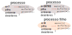

# Processos


Vídeo: https://youtu.be/rn2c7oA293s

## Mistério
Observe o seguinte programa:

```c 
#include <stdio.h>
#include <unistd.h>

int main() {
    int misterio = fork();
    if (misterio == 0)
        printf("Hello ");
    else
        printf("World ");
}
```

* Qual será o resultado da execução do programa?
    * O que é `fork`? O que retorna?
    * Qual `printf` será executado? "Hello " ou "World "?
    
* Resposta
    * `World Hello `
    * Os dois !!! 💣😲



https://ocaml.github.io/ocamlunix/processes.html#sec67

## Linha de comando

Como o usuário (não o programador), visualiza processos

* Um processo infinito
    * `$ yes`
        * Ops! CONTROL + C
* _Jobs_ na linha de comando
    * Em desuso
    * `$ jobs`
    * `$ yes > /dev/null`
    * CONTROL + Z
        * Suspensão
    * `$ jobs`
    * `$ bg` : _background_
        * Continuação, retomada
    * `$ jobs`
    * `$ fg` : _foreground_
        * CONTROL + C 
* `&`
    * `$ yes > /dev/null &`
    * Lança, suspende e continua
* `$ ps`
    * `$ ps aux` : todos os processos do sistema, com todos os dados
        * `man ps`
    * `$ top`

## `leave`

* Comando `leave`
    * `$ leave 0945`
    * Programa exemplo
        * https://ocaml.github.io/ocamlunix/processes.html#sec68
    * Versão simplificada
```c
#include <unistd.h>
#include <stdlib.h>
#include <stdio.h>

int main(int argc, char** argv) {
    unsigned int delay = atoi(argv[1]);
    if (fork() != 0)
        exit(0);
    sleep(delay);
    printf("\nLembrete!");
    exit(0);
}
```

## Resumo

* Chamadas de sistema
    * `fork`
    * `getpid`
* Funções
    * `sleep`
* Comandos
    * `jobs`
    * `ps`
    * `top`
    * CONTROL + Z, `bg`, `fg`, `&` 
    * CONTROL + C
    
# `wait`


* Sincronização entre processo-pai e processo-filho
* Mecanismo rudimentar de comunicação interprocessos
    * `exit`
* Livro-texto:
    * https://ocaml.github.io/ocamlunix/processes.html#sec69

``` 
        fork    wait (bloqueante)
 --------+------+.........--------
          \              /
           \____________/ exit(0)


        fork               wait (pronto)
 --------+------------------+--------
          \              /
           \____________/ exit(0)
```

---
* Funções do livro-texto convertidas para C
    * Busca em array
    * Busca por uma condição
        * Em C, a condição é fixa; como exemplo : "elemento igual a 57"
    * Divisão do array em 2 processos
    * O processo-filho comunica o resultado ao processo-pai através de `exit` e `wait`
```c
int busca_simples(int* array, int inicio, int fim) {
    int j;
    for (j = inicio; j<fim; j++) {
        if ( array[j] == 57 )
            return 1;
    }
    return 0;
}

int busca_dividida(int* array, int inicio, int fim) {

    if (fork() == 0) {
        exit( busca_simples(array, (inicio + fim)/2 + 1, fim) );
    } else {
        int achou_aqui = busca_simples(array, inicio, (inicio + fim)/2);
        int res = 0;
        wait(&res);
        if (WIFEXITED(res))
            return achou_aqui || WEXITSTATUS(res);
        exit(-1);
    }
}
```

---
* Estados de um processo
    * https://en.wikipedia.org/wiki/Process_state
* O processo `init`
    * O primeiro processo
    * pid == 1
    * Recebe todos os processos órfãos
    * https://pt.wikipedia.org/wiki/Init

## Kotlin
* Para ler Kotlin
    * https://developer.android.com/kotlin/learn

* `chamadas/src/macosMain/kotlin/cham/busca.kt`

```kotlin
fun <A> buscaSimples(cond: (A) -> Boolean, lista: List<A>): Boolean  =
    lista.any(cond)
```
* `buscaSimples`
    * `<A>` indica que é uma função genérica (se aplica a qualquer tipo `A`)
    * `cond` é um parâmetro-função, um predicado, o tipo `(A) -> Boolean` indica isso,
    uma função que recebe um único parâmetro do tipo `A` e retorna um `Boolean`
    * `lista` é uma lista genérica
    * `any` é um método da classe `List<E>` que retorna `true` se pelo menos um elemento
    da lista validar o predicado
    * Como é mais conciso invocar `x.any(p)` do que `buscaSimples(p,x)`,
    vamos dispensar essa definição

```kotlin
fun <A> buscaDividida(cond: (A)->Boolean, lista: List<A>): Boolean =
    when(fork()) {
        0    -> {
            val achou = lista.subList(0, lista.size / 2).any(cond);
            exit(if (achou) 0 else 1);
            false // nunca alcançado; apenas para satisfazer o retorno esperado
        }
        else -> {
            val achou = lista.subList(lista.size / 2 + 1, lista.size).any(cond);
            val (pid, r) = wait()
            when (r) {
                is WEXITED -> achou || (r.valor == 0)
                else -> false
            }
        }
    }
```
* `wait` não é o mesmo do C, mas uma reformulação 
    * Modifica a forma de retornar resultados
    * São dois resultados no par retornado
    
```kotlin
sealed class ProcessStatus
class WEXITED(val valor: Int) : ProcessStatus()
class WSIGNALED(val valor: Int) : ProcessStatus()
class WSTOPPED(val valor: Int) : ProcessStatus()

fun wait(): Pair<Int, ProcessStatus> = memScoped {
    val second = alloc<IntVar>()
    val pid = platform.posix.wait(second.ptr)
    val status = second.value and 0x7F  // Based on macOS/Catalina`s  sys/wait.h
    val code = second.value shr 8       // idem
    val res = when (status) {
        0    -> WEXITED(code)
        0x7F -> WSTOPPED(code)    // TODO test
        else -> WSIGNALED(code)   // TODO test
    }
    pid to res
}
```
